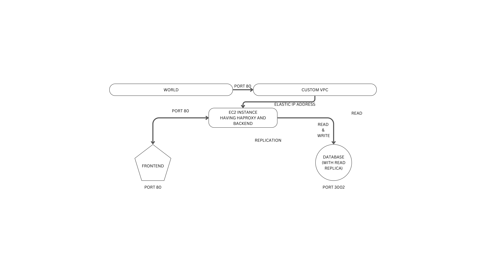

# Three tier Cloud Architecture via Terraform

## Summary

- The application is divided in three parts and hosted on AWS.
- Presentation Tier aka Frontend
- Application Tier aka Backend
- Data Tier aka Database

## Planned Architecture

- A custom VPC with
  - different subnets for EC2 instances and RDS.
  - An intergate gateway for EC2 instances.
- An EC2 Instance
  - provisioning haproxy and rsyslog.
  - having backend service uploaded automatically.
  - having all servers up and running.
- A PostgreSQL RDS with 1 read replica.
- A S3 bucket where frontend is hosted
  - which is only accessible from EC2 instance.
  - not public.

Haproxy will be configured for frontend and RDS.

### Completed

- A VPC is created with specific CIDR Block having
  - A subnet for EC2 instance
  - An internet gateway
  - Route table associated with EC2 subnet and internet gateway.
- A Elastic IP needs to be allocate using AWS CLI or UI.
- S3 bucket with policy and permission is configured.
  - The website is only accessible from EC2 instance and not for public.
  - Through HaProxy it is accessible.
- Single EC2 instance has been brought up where
  - haproxy and rsyslog got configured manually.
  - Frontend is accessible on port 80.

### In Progress

- installing & provisioning haproxy and rsyslog conf by replacing original.

---

### prerequisite/Dev Environment Setup

- AWS account
- Access and Secret key of the account you want to use.
- [AWS CLI](https://awscli.amazonaws.com/AWSCLIV2.msi)
- configure the aws cli with access and secret key `aws configure` on terminal editor.
- [terraform binary](https://www.terraform.io/downloads)
- add terraform path into environment variable to have global access.
- terraform will use your aws credential to talk to AWS.
