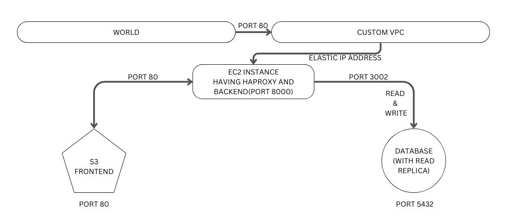

# Three tier Cloud Architecture via Terraform

Terraform is a tool that provides the ability to manage infrastructure through scripts while being the single source of truth. In other words, is an infrastructure as code tool that lets you define both cloud and on-prem resources in human-readable configuration files that you can version, reuse, and share.
[Terraform Modules](https://blog.devops.dev/terraform-modules-db392bb7e950) has been used in this project increasing the readibility and is easy to understand.

## Summary

- The application is divided in three parts and hosted on AWS.
- Presentation Tier aka Frontend
- Application Tier aka Backend
- Data Tier aka Database

## Planned Architecture

- A custom VPC with
  - different subnets for EC2 instances and RDS.
  - An internet gateway for EC2 instances.
- An EC2 Instance
  - provisioning haproxy and rsyslog.
  - having backend service uploaded automatically.
  - having all servers up and running.
- A PostgreSQL RDS with 1 read replica.
- A S3 bucket where frontend is hosted
  - which is only accessible from EC2 instance.
  - not public.

Haproxy will be configured for frontend and RDS.


### Completed

- A VPC is created with specific CIDR Block having
  - A subnet for EC2 instance
  - An internet gateway
  - Route table associated with EC2 subnet and internet gateway.
- A Elastic IP needs to be allocate using AWS CLI or UI.
- S3 bucket with policy and permission is configured.
  - The website is only accessible from EC2 instance and not for public.
  - Through HaProxy it is accessible.
- Single EC2 instance has been brought up where
  - haproxy and rsyslog got configured manually.
  - Frontend is accessible on port 80.
- Amazon RDS for PostgreSQL has been setup
  - that is only accessible from EC2 instances.

### In Progress

- Manually the HaProxy has been setup. Now trying to automate.

---

### prerequisite/Dev Environment Setup

- AWS account
- Access and Secret key of the account you want to use.
- [AWS CLI](https://awscli.amazonaws.com/AWSCLIV2.msi)
- configure the aws cli with access and secret key `aws configure` on terminal editor.
- [terraform binary](https://www.terraform.io/downloads)
- add terraform path into environment variable to have global access.
- terraform will use your aws credential to talk to AWS.

### Getting Started

- Clone the repo
- open the directory from any text editor.
- populate the secrets.tfvars.template file with actual values for the mentioned keys.
- Rename the secrets.tfvars.template to secrets.tfvars
- Change any values if you want.

```
git clone https://github.com/navsin189/getting-started-with-terraform.git terraform
cd terraform
update the secret file
mv secrets.tfvars.template secrets.tfvars
terrform init
terraform plan -var-file secrets.tfvars
# if no error
terraform apply -var-file secrets.tfvars
```

- Some AWS commands

```
# sync your files to S3 bucket.
aws s3 sync file_path/directory_path s3://<bucket_name>

# to delete a file
aws s3 rm s3://<bucket_name>/<file>

# to delete all
aws s3 rm s3://<bucket_name>/ --resursive
```
